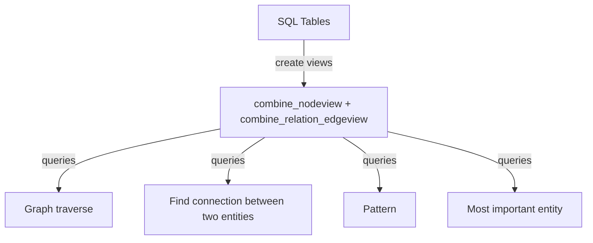

# graph-query-for-sql-db
Graph query for SQL database
Problem: End users need to initiate data queries based on various parameters, such as time, region, customer type, or product type. These queries must retrieve data from a standard SQL table schema where foreign keys may not be explicitly defined, or the table design may be suboptimal.  A standard SQL table join must be meticulously designed, developed, and tested for each possible combination of tables. Additionally, the process of transforming and storing data in a data warehouse is often associated with significant costs.

Solution: Design a database view that allows queries to be initiated using any entity type. Additionally, enable the exploration of entity types in any combination.

DataJoin.net provides in-depth education and consulting on graph queries for SQL tables.

Vocabulary: view is SQL database view, attribute or column is SQL table column.

## Flowchart  
