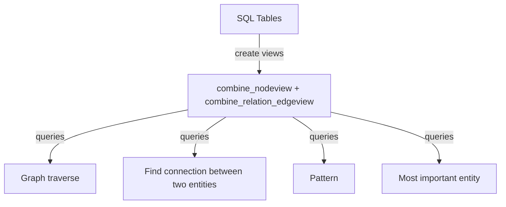

# graph-query-for-sql-db
Graph query for SQL database
Problem: End users need to initiate data queries based on various parameters, such as time, region, customer type, or product type. These queries must retrieve data from a standard SQL table schema where foreign keys may not be explicitly defined, or the table design may be suboptimal.  A standard SQL table join must be meticulously designed, developed, and tested for each possible combination of tables. Additionally, the process of transforming and storing data in a data warehouse is often associated with significant costs.

Solution: Design a database view that allows queries to be initiated using any entity type. Additionally, enable the exploration of entity types in any combination.

DataJoin.net provides in-depth education and consulting on graph queries for SQL tables.

Vocabulary: view is SQL database view, attribute or column is SQL table column.

## Flowchart  

# Typical SQL schema design	 
 
It is necessary to know what nodes and relationships are in the schema, and which one is needed for Graph Query.
In the above example, Nodes (entities) are Product type, order type, customer, sales order, address and sales order ship to address.
Relationships ae: sales order and product type, sales order and order type, sales order and customer, sales order and address (sale order ship to address)
	
# Combine nodeview  
Find nodes (entities) from all tables and create one single SQL view so that any entity type or entity id can be searched using this view. This SQL view has “SELECT” statement from all tables connected using UNION.

create_combine_nodeview.sql  

# Combine relation(edge) view  
Find relationships (edge) from all tables and create one single SQL view so that nodes (entities) are connected (related) using this view. This SQL view has “SELECT” statement for all different types of relationships from SQL tables. As mentioned earlier in this document, relationships in table can be explicit foreign key or implied foreign to another table. Relationships can be an attribute where values picked from a lookup table.

create_combine_relation_edgeview.sql  

#   Example data of node view
combine_nodeview	 	 
entity_id	entity_type	entity_value
address:a1	address	street address1
address:a2	address	street address2
customer:c1	customer	xyz
order_type:retail	order_type	retail
product_type:p1	product_type	laptop
sales_order:ord1	sales_order	new order
sales_order_shipto_address:1-1	sales_order_shipto_address	1-1
sales_order_shipto_address:1-2	sales_order_shipto_address	1-2

# Example data of relationship view  
combine_relation_edgeview	
from_id	to_id	predicate
address:a1	sales_order:ord1	order_address
address:a2	sales_order:ord1	order_address
customer:c1	sales_order:ord1	product_type
order_type:retail	sales_order:ord1	order_type
product_type:p1	sales_order:ord1	product_type
sales_order:ord1	address:a1	order_address
sales_order:ord1	address:a2	order_address
sales_order:ord1	customer:c1	customer
sales_order:ord1	order_type:retail	order_type
sales_order:ord1	product_type:p1	product_type

# Graph Queries  
Search and pick entity ids for queries  
It is necessary to pick the first entity for graph traverse query and then search traverse through graph nodes.
It is necessary to search and pick two entities to use query to find relationship path between them.
The following query can be used to search 

-- The following query can be used to search and pick the first entity (node) using approximate entity name.
SELECT entity_id FROM public.combine_nodeview 
 where entity_value like '%new%'

-- The following query can be used to search and pick the first entity (node) using approximae entity type.
 SELECT entity_id FROM public.combine_nodeview 
 where entity_type like '%customer%'

# Graph traverse queries   
Graph traverse means: Find or pick the first entity, then, find which other entities have relationship with the first entity. This entity-to-entity search (or hopping) can continue as per need. This type of query is more suitable for category-to-category exploration since the counts of categories can be hundreds or thousands and not in millions. It is possible to construct a query so it would do the count of next entities first before it would try to retrieve large amounts of data as part of query. Also, it is possible to avoid circular relationship (reference) that can duplicate data without any value. For example, A is related to B and then B is related to A. A is related to A itself.  This type of relationship will keep showing results in each next hop without adding new information.
graph_traverse_query.sql   
Graph traverse queries filters  
Proposed node view can have the following filter field. Dedicated tables may have the following filters such as
 organization, Graph group, active flag, connector type (category or item), Counts, etc.

CREATE OR REPLACE VIEW public.combine_nodeview_test  AS
SELECT 'sales_order' || ':' ||cast(sales_order.order_id as text) AS entity_id,'sales_order' AS entity_type,sales_order.description AS entity_value, sales_order.organization_id AS organization_id FROM sales_order
  UNION 
SELECT 'address' || ':' ||cast(address.address_id as text) AS entity_id,'address' AS entity_type,address.address AS entity_value, address.organization_id AS organization_id FROM address
Etc.  

SELECT
n1.entity_id from_entity_id,n1.entity_type from_entity_type,n1.entity_value from_entity_value,reln1.predicate Relationship,n2.entity_id to_entity_id,n2.entity_type to_entity_type,n2.entity_value to_entity_value
 FROM 
combine_nodeview n1
,combine_relation_edgeview reln1
,combine_nodeview n2 
WHERE 
reln1.from_id = n1.entity_id 
 and reln1.to_id = n2.entity_id 
and n1.organization_id='org1'
and n2.organization_id='org1'
 and n1.entity_id='customer:c1'
order by from_entity_type,from_entity_value,to_entity_type,to_entity_value;  

Graph traverse queries large connection quantity detection  
Count the relationship before retrieving the data. In some cases, there are large relationships, for example, an entity location tracking table may have location in thousands or more for one entity id.  
count_of_next_relationships.sql  

# Graph traverse queries circular reference avoidance  
It is necessary to avoid circular relationship (reference) that can duplicate data without any value. For example, A is related to B and then B is related to A. It is also possible that A is related to A itself.  This type of relationship will keep showing results in each next hop without adding new information.

# What is circular reference  

# Find connection between two entities (nodes)  
A typical example such query is person to person, person to phone number, person to address scenarios.  If you have names of two people and you want to find if they are related to each other through other people or addresses. For graph queries for SQL, it is necessary to construct separate queries for each hop. Thus, a one hop query would produce result if two entities are connected directly (one hop).  For example, Person A and Person B are brothers. A two-hop query would produce results if two entities are related to each other through other entities. For example, person A lived at Address X and then Address X is also related to Person B (Person B lived at Address X).  

Three hop query: Relationship between two entities are three hop apart (level). 
For example, node1related to node2related tonode3  
3hop_relationship_chain_between_two_entities.sql  

Four hop query: Relationship between two entities are four hop apart (level).  
For example, node1related to node2related tonode3related tonode4  
4hop_relationship_chain_between_two_entities.sql  

# Pattern query  
Pattern is defined as: Person A visits Coffee shop B.  Another pattern can be Person A calls Person B.  In these examples, it would be necessary to find how many times this pattern is repeated over time.  
Pattern is relationship. A pattern (relationship) can be associated with multiple starting entities.  

Example of patterns  
Pattern can be People visiting coffee shops (entity type to entity pattern)  
People visiting specific coffee shop (entity type to specific entity pattern)  
People calling specific number (entity type to specific entity)  

--pattern query entity type to entity type  
pattern_query_entity_type_to_entity_type.sql  
--pattern query entity type to specific entity  
pattern_query entity_type_to_specific_entity.sql  

# Important entity query  
It may be necessary to find out who is the person most people call or send email. Another example would be which place is most visited by the type of people. This query is useful to find out which one person is most contacted by an organization. That person may be the leader or that person may be very closely related to the leader.  

important_entity_query.sql  

# Graph query code  
Setup database  
Step 1: create testgraphquery database using admin UI  
Step 2: create tables using scripts from testgraphquery_backup.sql  
Step 3: create views using scripts from testgraphquery_backup.sql  
Step 4: Import data in tables from csv file using admin UI (right click on a table, pick import/export, pick csv file)  

# Run queries  
See the Graph query section above.  

